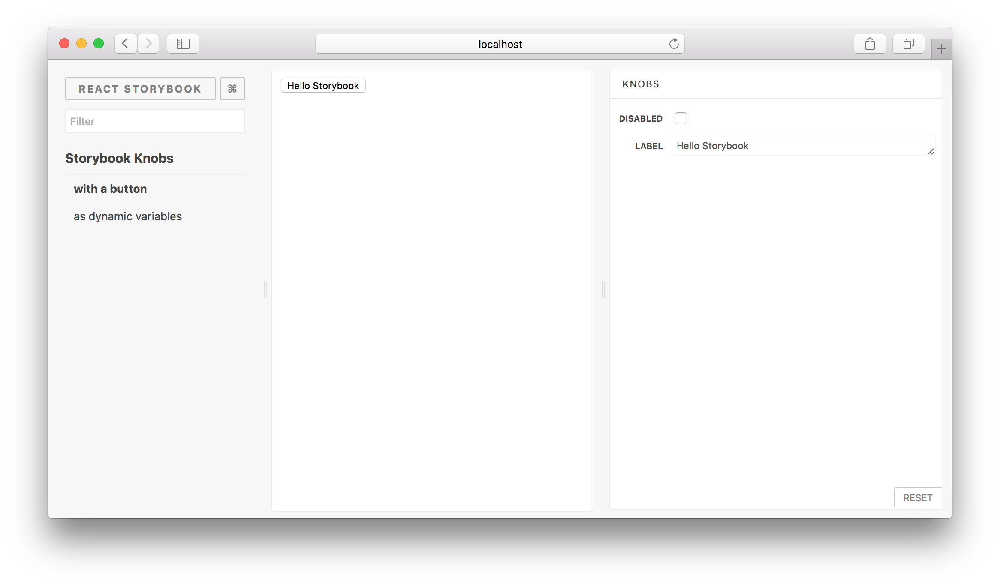

# Storybook Addon Knobs

Storybook Addon Knobs allow you to edit React props dynamically using the Storybook UI.
You can also use Knobs as a dynamic variable inside stories in [Storybook](https://storybook.js.org).

[](https://greenkeeper.io/)
[](https://circleci.com/gh/storybooks/storybook)
[](https://www.codefactor.io/repository/github/storybooks/storybook)
[](https://snyk.io/test/github/storybooks/storybook/8f36abfd6697e58cd76df3526b52e4b9dc894847)
[](https://bettercodehub.com/results/storybooks/storybook) [](https://codecov.io/gh/storybooks/storybook)  
[](https://now-examples-slackin-nqnzoygycp.now.sh/)
[](#backers) [](#sponsors)

This addon works with Storybook for:
[React](https://github.com/storybooks/storybook/tree/master/app/react).
[React Native](https://github.com/storybooks/storybook/tree/master/app/react-native).
[Vue](https://github.com/storybooks/storybook/tree/master/app/vue).

This is how Knobs look like:

[](https://git.io/vXdhZ)

> Checkout the above [Live Storybook](https://git.io/vXdhZ) or [watch this video](https://www.youtube.com/watch?v=kopW6vzs9dg&feature=youtu.be).

## Getting Started

First of all, you need to install knobs into your project as a dev dependency.

```sh
npm install @storybook/addon-knobs --save-dev
```

Then, configure it as an addon by adding it to your `addons.js` file (located in the Storybook config directory).

```js
import '@storybook/addon-knobs/register'
```

Now, write your stories with knobs.

```js
import { storiesOf } from '@storybook/react';
import { withKnobs, text, boolean, number } from '@storybook/addon-knobs/react';

const stories = storiesOf('Storybook Knobs', module);

// Add the `withKnobs` decorator to add knobs support to your stories.
// You can also configure `withKnobs` as a global decorator.
stories.addDecorator(withKnobs);

// Knobs for React props
stories.add('with a button', () => (
  <button disabled={boolean('Disabled', false)} >
    {text('Label', 'Hello Button')}
  </button>
));

// Knobs as dynamic variables.
stories.add('as dynamic variables', () => {
  const name = text('Name', 'Arunoda Susiripala');
  const age = number('Age', 89);

  const content = `I am ${name} and I'm ${age} years old.`;
  return (<div>{content}</div>);
});
```

> In the case of Vue, use these imports:
>
> ```js
> import { storiesOf } from '@storybook/vue';
> import { withKnobs, text, boolean, number } from '@storybook/addon-knobs/vue';
> ```
>
> In the case of React-Native, use these imports:
>
> ```js
> import { storiesOf } from '@storybook/react-native';
> import { withKnobs, text, boolean, number } from '@storybook/addon-knobs/react';
> ```
>
> In the case of Angular, use these imports:
>
> ```js
> import { storiesOf } from '@storybook/angular';
> import { withKnobs, text, boolean, number } from '@storybook/addon-knobs/angular';
> ```

You can see your Knobs in a Storybook panel as shown below.



### Additional Links

-   Introduction blog post.
-   Watch this video on how to use knobs
-   [Live Storybook with Knobs](https://goo.gl/uX9WLf)
-   Have a look at this [sample Storybook repo](https://github.com/kadira-samples/storybook-knobs-example).

## Available Knobs

These are the knobs available for you to use. You can import these Knobs from the `@storybook/addon-knobs` module.
Here's how to import the **text** Knob.

```js
import { text } from '@storybook/addon-knobs';
```

Just like that, you can import any other following Knobs:

### text

Allows you to get some text from the user.

```js
import { text } from '@storybook/addon-knobs/react';

const label = 'Your Name';
const defaultValue = 'Arunoda Susiripala';

const value = text(label, defaultValue);
```

### boolean

Allows you to get a boolean value from the user.

```js
import { boolean } from '@storybook/addon-knobs/react';

const label = 'Agree?';
const defaultValue = false;

const value = boolean(label, defaultValue);
```

### number

Allows you to get a number from the user.

```js
import { number } from '@storybook/addon-knobs/react';

const label = 'Age';
const defaultValue = 78;

const value = number(label, defaultValue);
```

### number bound by range

Allows you to get a number from the user using a range slider.

```js
import { number } from '@storybook/addon-knobs/react';

const label = 'Temperature';
const defaultValue = 73;
const options = {
   range: true,
   min: 60,
   max: 90,
   step: 1,
};

const value = number(label, defaultValue, options);
```

### color

Allows you to get a colour from the user.

```js
import { color } from '@storybook/addon-knobs/react';

const label = 'Color';
const defaultValue = '#ff00ff';

const value = color(label, defaultValue);
```

### object

Allows you to get a JSON object or array from the user.

```js
import { object } from '@storybook/addon-knobs/react';

const label = 'Styles';
const defaultValue = {
  backgroundColor: 'red'
};

const value = object(label, defaultValue);
```

> Make sure to enter valid JSON syntax while editing values inside the knob.

### array

Allows you to get an array of strings from the user.

```js
import { array } from '@storybook/addon-knobs/react';

const label = 'Styles';
const defaultValue = ['Red']

const value = array(label, defaultValue);
```

> While editing values inside the knob, you will need to use a separator.
> By default it's a comma, but this can be override by passing a separator variable.
>
> ```js
> import { array } from '@storybook/addon-knobs/react';
>
> const label = 'Styles';
> const defaultValue = ['Red'];
> const separator = ':';
> const value = array(label, defaultValue, separator);
> ```

### select

Allows you to get a value from a select box from the user.

```js
import { select } from '@storybook/addon-knobs/react';

const label = 'Colors';
const options = {
  red: 'Red',
  blue: 'Blue',
  yellow: 'Yellow',
};
const defaultValue = 'red';

const value = select(label, options, defaultValue);
```

> You can also provide options as an array like this: `['red', 'blue', 'yellow']`

### date

Allow you to get date (and time) from the user.

```js
import { date } from '@storybook/addon-knobs/react';

const label = 'Event Date';
const defaultValue = new Date('Jan 20 2017');
const value = date(label, defaultValue);
```

> Note: the default value must not change - e.g., do not do `date('Label', new Date())` or `date('Label')`

### withKnobs vs withKnobsOptions

If you feel like this addon is not performing well enough there is an option to use `withKnobsOptions` instead of `withKnobs`.
Usage:

```js
import { storiesOf } from '@storybook/react';

const stories = storiesOf('Storybook Knobs', module);

stories.addDecorator(withKnobsOptions({
  debounce: { wait: number, leading: boolean}, // Same as lodash debounce.
  timestamps: true // Doesn't emit events while user is typing.
}));
```

## Typescript

If you are using typescript, make sure you have the type definitions installed for the following libs:

-   node
-   react

You can install them using `npm install -save @types/node @types/react`, assuming you are using Typescript >2.0.
